# SSVEP EEG Pilot: Overt Direct-Gaze Paradigm with Photodiode Triggers

This repository contains a complete pilot pipeline for an **overt direct-gaze SSVEP EEG experiment** using PsychoPy, photodiode-based event triggers, and post-hoc EEG validation analyses.

The project includes:

- PsychoPy experiment scripts for visual SSVEP stimulation.
- Raw EEG recordings in HDF5 format.
- PsychoPy behavioral/timing output files.
- Photodiode trigger images.
- Impedance screenshots.
- Step-by-step analysis scripts.
- Generated QC, SSVEP, CCA, and permutation-control outputs.

The current repository documents a first pilot recording from one participant using an overt direct-gaze paradigm.

---

## Project Overview

The goal of this pilot was to validate a basic SSVEP EEG recording workflow before scaling the experiment to more participants or more complex paradigms.

The core validation questions were:

1. Can we present stable left/right flickering visual targets using PsychoPy?
2. Can photodiode triggers be recorded reliably in the EEG stream?
3. Can we recover the intended SSVEP frequencies from posterior EEG channels?
4. Can trial labels be decoded from EEG using spectral and CCA-based analyses?
5. Can the full workflow be reproduced from the stored raw EEG and PsychoPy files?

The final analysis suggests that the pilot contains clear frequency-specific SSVEP responses, especially in posterior channels, and that CCA-based classification successfully separates 9 Hz and 14 Hz trials.

---

## Experiment Design

### Paradigm

The experiment uses an **overt direct-gaze SSVEP paradigm**.

In each trial:

1. A fixation cross is shown.
2. One side is cued.
3. The participant directly looks at the cued flickering square.
4. Two squares flicker simultaneously:
   - left square: 9 Hz
   - right square: 14 Hz
5. The attended side is logged in the PsychoPy output and encoded in the EEG stream using photodiode triggers.

### Current Design Parameters

| Parameter | Value |
|---|---:|
| Paradigm type | Overt direct gaze |
| Left flicker frequency | 9 Hz |
| Right flicker frequency | 14 Hz |
| Trial stimulation duration | 30 s in the recorded pilot |
| Blocks | 4 |
| Trials per block | 10 |
| Total intended trials | 40 |
| EEG sampling rate | 512 Hz |
| Trigger method | On-screen photodiode patches |
| Trigger side | Indicates attended side |
| Trigger repetition | At trial onset and repeated during stimulation |

> Note: Some earlier pilot scripts are kept for traceability, but `psychopy_ssvep_pilot_V4.py` is the current experiment script used for the finalized overt/direct-gaze setup.

---

## Hardware Setup

The pilot was recorded using a g.tec EEG setup.

| Component | Role |
|---|---|
| g.USBamp | EEG amplifier |
| g.TRIGbox | Trigger interface |
| Photodiode sensors | Detect on-screen trigger patches |
| External monitor | Visual stimulation display |
| PsychoPy laptop | Stimulus presentation |
| HDF5 EEG recording | Raw EEG storage format |

Photodiode trigger images are stored in:

```text
trigger_images/
├── ScreenTrigOn.png
└── ScreenTrigOff.png
```

The PsychoPy script loads these images relative to the project root.

---

## Repository Structure

```text
First SSVEP EEG Recording- Overt/
│
├── EEG Recorded data/
│   ├── Subject12026.04.30_13.59.13.hdf5
│   └── Subject1-12026.04.30_14.20.19.hdf5
│
├── data/
│   ├── *_trials.csv
│   ├── *_meta.txt
│   ├── *_timingSummary.txt
│   └── *_frameIntervals_ms.txt
│
├── Scripts/
│   ├── psychopy_ssvep_pilot_V4.py
│   ├── 01_inspect_hdf5_ssvep.py
│   ├── 02_merge_qc_triggers_ssvep.py
│   ├── 03_detailed_ssvep_analysis.py
│   ├── 04_harmonic_cca_ssvep_analysis.py
│   └── 05_permutation_sanity_check.py
│
├── trigger_images/
│   ├── ScreenTrigOn.png
│   └── ScreenTrigOff.png
│
├── figures/
│   ├── Impedance.PNG
│   └── Impedance_After.PNG
│
├── _analysis_report/
│   ├── step02/
│   ├── step03/
│   ├── step04/
│   └── step05/
│
├── run_analysis_all.bat
├── reorganize_ssvep_project.py
├── environment-psychopy.yml
├── environment-analysis.yml
├── requirements-analysis.txt
├── .gitattributes
├── .gitignore
└── README.md
```

---

## Important Note About Raw EEG Files

This repository is designed to include raw EEG files in `.hdf5` format. These files can be large, so they should be tracked using **Git LFS**.

Before committing HDF5 files, run:

```bash
git lfs install
git lfs track "*.hdf5"
git lfs track "*.h5"
git add .gitattributes
```

Then confirm that HDF5 files are tracked by Git LFS:

```bash
git lfs ls-files
```

If raw EEG files were already committed before enabling Git LFS, they may need to be removed from normal Git history and recommitted through LFS.

---

## Environment Recommendation

This project uses **two separate environments**:

1. A PsychoPy environment for running the visual experiment.
2. A lightweight analysis environment for processing EEG data.

This separation is intentional. PsychoPy has many display/audio/hardware-related dependencies, while the analysis pipeline mainly needs NumPy, SciPy, pandas, matplotlib, h5py, and scikit-learn. Keeping them separate reduces dependency conflicts and makes the analysis easier to reproduce on machines that do not need to run the actual experiment.

---

## How to Run the PsychoPy Experiment

### 1. Create the PsychoPy environment

From the project root:

```bash
conda env create -f environment-psychopy.yml
conda activate psychopy
```

If you already have a working PsychoPy environment, you can use that instead.

### 2. Confirm trigger images exist

Make sure these files are present:

```text
trigger_images/ScreenTrigOn.png
trigger_images/ScreenTrigOff.png
```

### 3. Run the experiment

```bash
python Scripts/psychopy_ssvep_pilot_V4.py
```

On Windows Command Prompt:

```bat
python Scripts\psychopy_ssvep_pilot_V4.py
```

### 4. Output files

PsychoPy output files are written to:

```text
data/
```

Expected output types include:

```text
*_trials.csv
*_meta.txt
*_timingSummary.txt
*_frameIntervals_ms.txt
```

---

## How to Run the Analysis

### 1. Create the analysis environment

```bash
conda env create -f environment-analysis.yml
conda activate ssvep-analysis
```

Alternatively, using pip:

```bash
pip install -r requirements-analysis.txt
```

### 2. Confirm input data

Raw EEG files should be in:

```text
EEG Recorded data/
```

PsychoPy files should be in:

```text
data/
```

### 3. Run all analysis steps

On Windows:

```bat
run_analysis_all.bat
```

This runs:

```bat
python Scripts\01_inspect_hdf5_ssvep.py --data_dir "EEG Recorded data" --psychopy_dir "data"
python Scripts\02_merge_qc_triggers_ssvep.py --data_dir "EEG Recorded data" --psychopy_dir "data"
python Scripts\03_detailed_ssvep_analysis.py --data_dir "EEG Recorded data"
python Scripts\04_harmonic_cca_ssvep_analysis.py --data_dir "EEG Recorded data"
python Scripts\05_permutation_sanity_check.py --data_dir "EEG Recorded data"
```

### 4. Run steps manually

#### Step 01: Inspect HDF5 and PsychoPy files

```bash
python Scripts/01_inspect_hdf5_ssvep.py --data_dir "EEG Recorded data" --psychopy_dir "data"
```

Outputs:

```text
_analysis_report/01_hdf5_inventory.json
_analysis_report/01_hdf5_inventory_readable.txt
_analysis_report/01_psychopy_inventory.json
_analysis_report/01_psychopy_inventory_readable.txt
```

#### Step 02: Merge, QC, trigger mapping, and first PSD/SNR check

```bash
python Scripts/02_merge_qc_triggers_ssvep.py --data_dir "EEG Recorded data" --psychopy_dir "data"
```

Outputs:

```text
_analysis_report/step02/
```

Key files:

```text
02_summary_report.txt
02_trial_event_match.csv
02_channel_quality.csv
02_ssvep_channel_summary.csv
02_trigger_timeline.png
02_channel_qc_robust_std.png
02_occipital_psd_left_vs_right.png
```

#### Step 03: Detailed SSVEP SNR analysis

```bash
python Scripts/03_detailed_ssvep_analysis.py --data_dir "EEG Recorded data"
```

Outputs:

```text
_analysis_report/step03/
```

Key files:

```text
03_summary_report.txt
03_condition_summary.csv
03_best_channels.csv
03_trial_level_ssvep.csv
03_condition_target_vs_nontarget_snr.png
03_selected_posterior_psd_by_condition.png
03_trial_level_evidence.png
03_best_channels_evidence.png
```

#### Step 04: Harmonic CCA analysis

```bash
python Scripts/04_harmonic_cca_ssvep_analysis.py --data_dir "EEG Recorded data"
```

Outputs:

```text
_analysis_report/step04/
```

Key files:

```text
04_summary_report.txt
04_trial_level_cca.csv
04_condition_cca_summary.csv
04_cca_9_vs_14_scatter.png
04_cca_accuracy_by_condition.png
04_cca_trial_margin.png
```

#### Step 05: Permutation and sanity checks

```bash
python Scripts/05_permutation_sanity_check.py --data_dir "EEG Recorded data"
```

Outputs:

```text
_analysis_report/step05/
```

Key files:

```text
05_summary_report.txt
05_trial_sanity_check.csv
05_condition_sanity_summary.csv
05_permutation_accuracy_hist.png
05_signed_margin_hist.png
05_target_vs_nontarget_rho.png
05_target_vs_nontarget_scatter.png
```

---

## Main Results

The current pilot analysis supports the presence of SSVEP responses in the EEG data.

Main findings:

- The EEG recording contains valid photodiode-triggered event structure.
- Trigger type IDs were mapped to attended side:
  - `15`: left-attend trials
  - `16`: right-attend trials
- Posterior channels showed the strongest SSVEP evidence.
- CCA analysis separated 9 Hz and 14 Hz trials with strong trial-level consistency.
- Permutation and sign-flip checks supported that the CCA result was not explained by random label assignment.

Important caveats:

- This is currently a single-subject pilot.
- Several electrodes had high impedance or poor signal quality.
- Dropped frames and monitor timing should continue to be monitored in future recordings.
- The recording was split into two HDF5 files and merged during analysis.

---

## Key Figures

### Impedance Before Recording

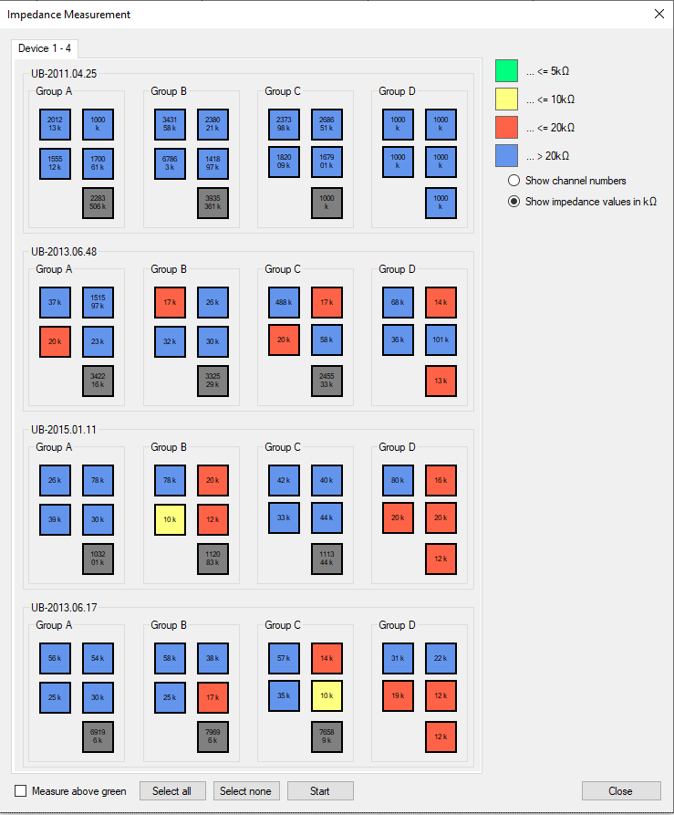

### Impedance After Recording

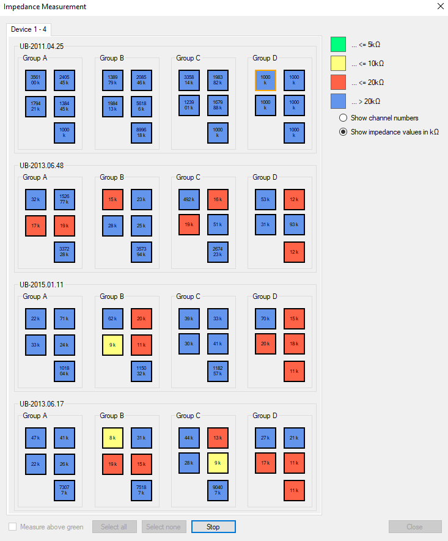

### Channel QC

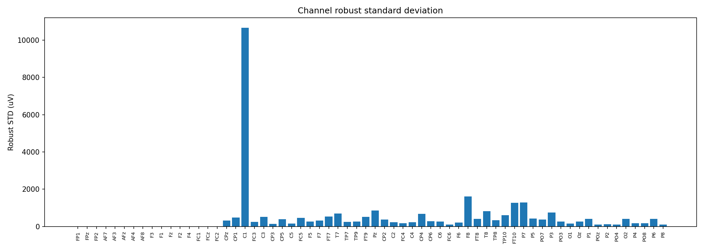

### Trigger Timeline

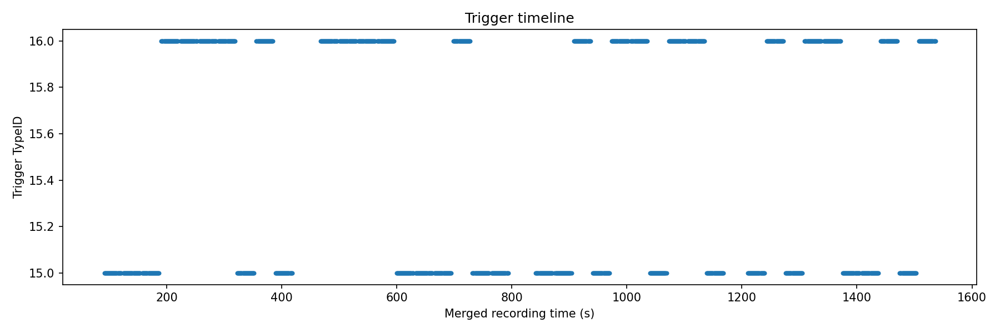

### Posterior PSD by Condition

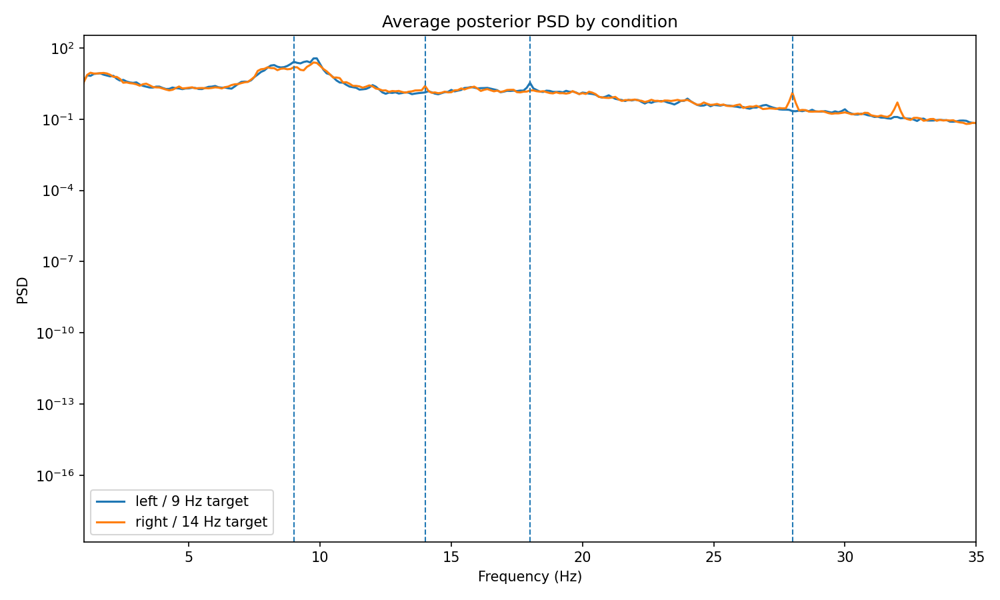

### Target vs Non-target SSVEP SNR

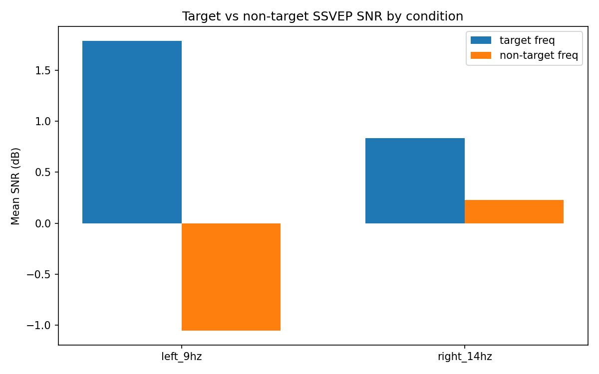

### Best Posterior Channels

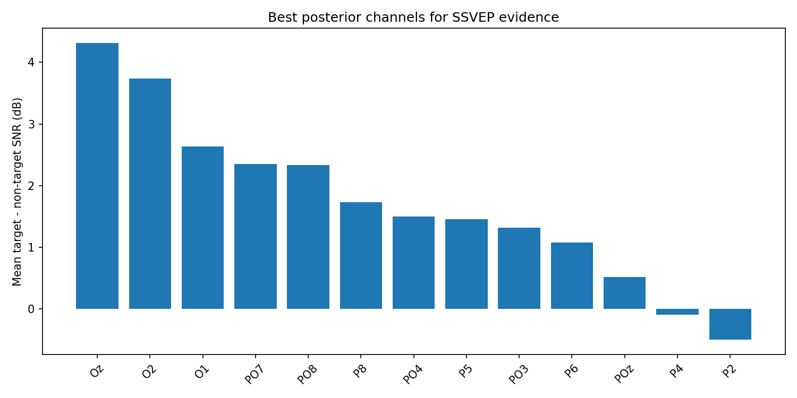

### CCA Evidence: 9 Hz vs 14 Hz

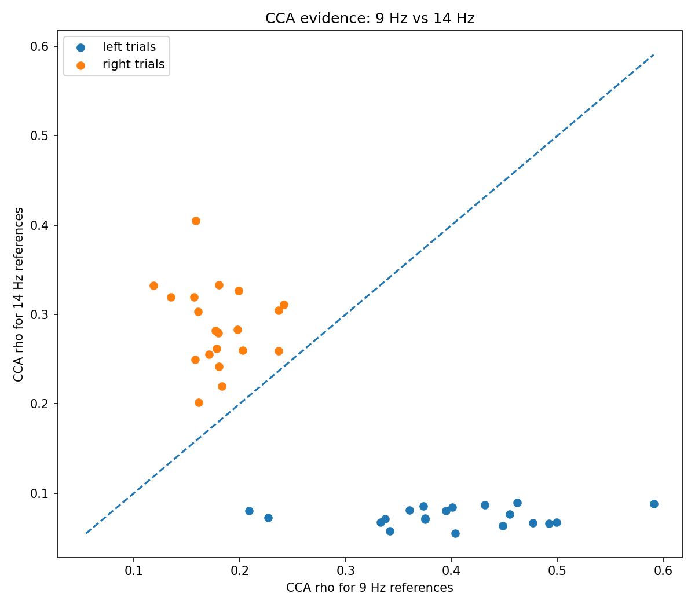

### CCA Accuracy by Condition

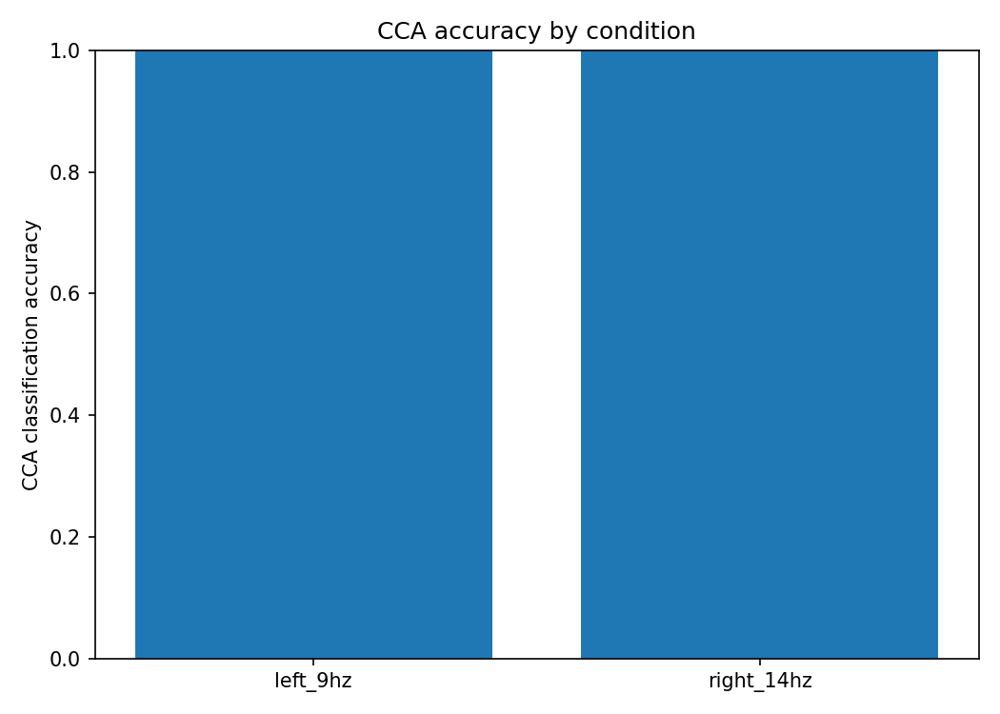

### Permutation Control

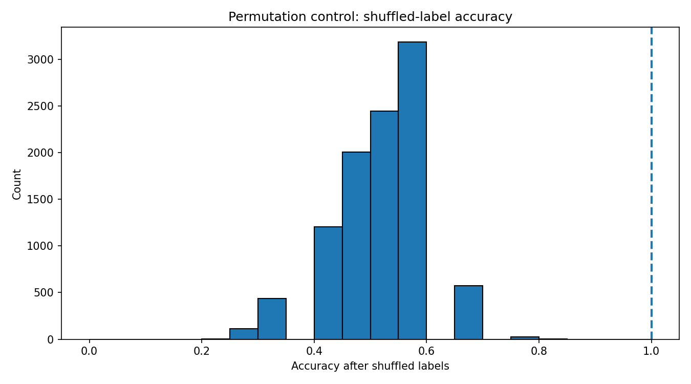

### Target vs Non-target CCA Rho

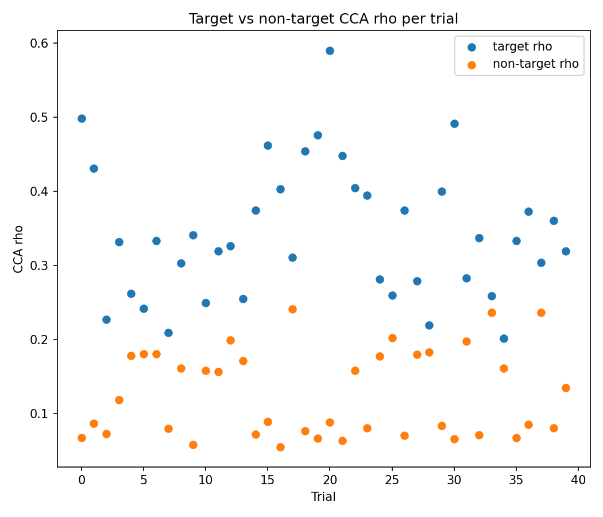

---

## Reproducing the Current Results From a Fresh Clone

```bash
git clone https://github.com/AliAmini93/SSVEP.git
cd SSVEP
git lfs pull
conda env create -f environment-analysis.yml
conda activate ssvep-analysis
run_analysis_all.bat
```

If the repository is cloned on Linux/macOS, run the Python commands from the analysis section manually instead of using the Windows batch file.

---

## Adding a New Subject

For a new recording:

1. Place new HDF5 files in:

```text
EEG Recorded data/
```

2. Place the corresponding PsychoPy output files in:

```text
data/
```

3. Run:

```bat
run_analysis_all.bat
```

4. Review:

```text
_analysis_report/
```

For multi-subject use, it is recommended to create subject-specific subfolders or extend the analysis scripts to accept a subject ID.

---

## Limitations and Next Steps

Current limitations:

- Single-subject pilot only.
- Some channels were noisy or had high impedance.
- The current report focuses on overt direct gaze only.
- The analysis does not yet include group-level statistics.

Recommended next steps:

1. Record additional participants.
2. Improve impedance quality before recording.
3. Monitor frame timing and dropped frames during each session.
4. Extend the pipeline to support subject-level folders.
5. Add group-level SSVEP and CCA summaries.
6. Compare overt and covert paradigms in a future extension.

---

## Contact

**Ali Amini**  
Ph.D. project: EEG/EMG and deep learning methods for emotion recognition and prediction in VR serious games.

Repository: <https://github.com/AliAmini93/SSVEP>
